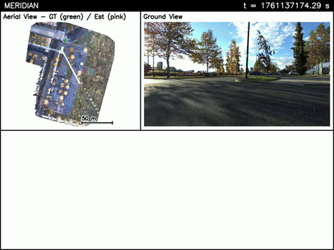

# Meridian: Metric-Semantic Primitive Matching for Cross-View Geo-Localization Beyond Urban Environments

Meridian is an algorithm for localizing a ground robot from aerial ortho-imagery, providing meter-level pose estimates without any initial pose information or environmental fine-tuning.
To do this, sparse point and line primitives are matched across aerial and ground views, and robust pose graph optimization is employed to find a set of consistent pose measurements over time.

Currently, `meridian` exists as a stand-alone Python package (with heavy computation implemented in C++ or using GPU via PyTorch). 
A ROS2 wrapper is coming soon!

This repo contains instructions for running the Meridian pipeline on our self-collected datasets.
For now, we have a small sampler for use as a demo, but our full cross-view geo-localization "Camp Dataset" will be released soon.



## Citation


If you find this repo useful in your work, please cite our [paper](https://arxiv.org/pdf/2606.06312):

M. Peterson, Q. Li, Y. Jia, F. Cladera, C. Nieto-Granda, C.J. Taylor, and J.P. How, "Meridian: Metric-Semantic Primitive Matching for Cross-View Geo-Localization Beyond Urban Environments," arXiv preprint arXiv:2606.06312, 2026.

```
@inproceedings{peterson2025roman,
  title={Meridian: Metric-Semantic Primitive Matching for Cross-View Geo-Localization Beyond Urban Environments},
  author={Peterson, Mason and Qingyuan, Li and Jia, Yixuan and Cladera, Fernando and Nieto-Granda, Carlos and Taylor, Camillo Jose and How, Jonathan P},
  journal={arXiv preprint arXiv:2606.06312},
  year={2026}
}
```

## Install

We recommend using this repo with a Python virtual environment. 

To install, clone and `cd` into this repo, activate your environment, and run

```
source ./install/install.sh
```

After installation, set the following environment variable in your `bashrc` or `zshrc`:

```
export MERIDIAN_WEIGHTS=<path to meridian repo>/weights
```

<!-- Clone this repo and `pip install .`

Additionally follow the instructions for installing AnyLoc [here](git@github.com:AnyLoc/AnyLoc.git). -->

<!-- For use beyond the vanilla install, check out the [optional set up steps](#optional-set-up) -->

## Pipeline Demo

Once installed, the full pipeline can be run on our experimental data.

**Data Set Up**

To make this as easy as possible, we host an aerial image and a minimal ROS bag for use in running our pipeline.

To download the data run (will download ~8 GB):

```
source ./install/download_demo_data.sh <desired output directory>
```

**Running Pipeline**

Next, set an environment variable pointing to the Meridian demo data:

```
export MERIDIAN_DEMO_DATA=<path to demo data>
```

Then, the meridian demo can be run with 

```
python3 -m meridian.pipeline.cross_view_incremental \
  --aeril $MERIDIAN_DEMO_DATA/aerial_primitives \
  -p ./cfg/demo.yaml \
  -o ./demo_output/ \
  -m --live
```

The `-m` and `--live` commands can be removed to run the demo without the visulization which greatly reduces the run-time.

<!-- Code is provided for running Meridian on KITTI data. 
To do so, download [KITTI odometry](https://www.cvlibs.net/datasets/kitti/eval_odometry.php) processed data (for images and lidar scans) and raw data (for ground truth).
Convert the processed data to a ROS2 bag using [kitti2mcap](./third_party/kitti2mcap).
Additionally, install [KISS-ICP](https://github.com/prbonn/kiss-icp) and run KISS-ICP on the processed data bag to get odometry measurements.
Finally, download KITTI aerial overhead from [Vexcel](https://www.vexcel-imaging.com/).

Then, set the following environment variables:

```
export KITTI=<path to data>
export KITTI_SEQ=00 # or other sequence
export KITTI_AERIAL_IMG=<path to aerial image>
```

To run:

```
python3 -m meridian.pipeline.cross_view_incremental -p <path to this repo>/cfg/kitti.yaml -r <sequence num> -o <output directory>
```

`-m` can be added to create the output visualization. -->

<!-- ## Optional Set Up -->

<!-- **AnyLoc**

Typically, we use AnyLoc for initial place recognition.
To make our code easily accessible, the minimal demo uses a DINO-based place recognition that is much faster and doesn't require any additional installations.
However, the simple DINO-based place recognition struggles when aerial maps are large.
To set up Meridian with the more performant AnyLoc place recognition, clone AnyLoc and   -->

## Acknowledgements
This research is supported by ARL DCIST under Cooperative Agreement Number W911NF-17-2-0181 and DSTA.

Portions of this software were written using Claude Code.
